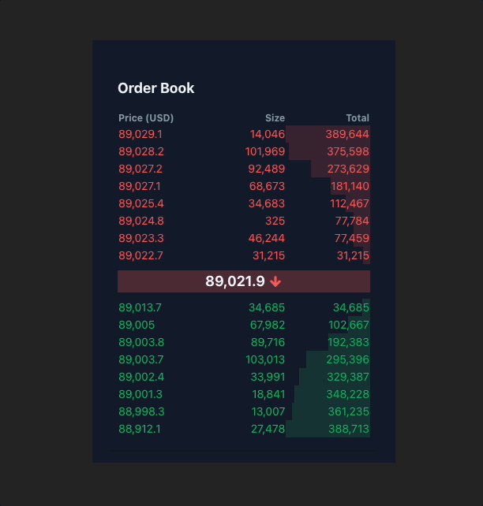

# Orderbook



## Overview
**Orderbook** is a real-time order book display application that utilizes the BTSE Futures WebSocket API to provide live data updates. Built with React as the primary front-end framework, this project aims to deliver a clear, dynamic, and visually engaging order book interface, complete with animations to highlight changes in buy and sell data.

## Tech Stack
- Framework: React
- Build Tool: Vite
- Languages: JavaScript / TypeScript

## Installation and Usage

This project uses **Bun** as the package manager.

### Clone the Repository:
```bash
git clone https://github.com/futianshen/orderbook.git
cd orderbook
```

### Install Dependencies:

```bash
bun install
```

### Start the Development Server:

```bash
bun run dev
```

### Build for Production:

```bash
bun run build
```
